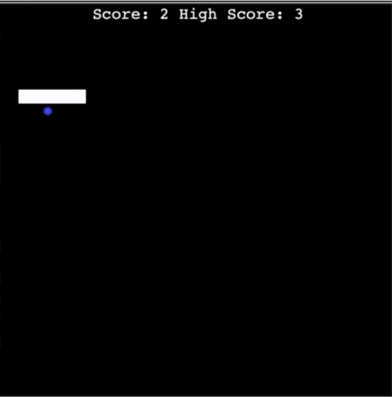

# Snake Game
This project is about creating Snake Game using Python Turtle Graphics.

Add Food and Detect Collisions with Food  

Create a Scoreboard and Keep Score  

Detect Collisions with the Wall  

Extend the Snake When Detect Collisions with Food  

Detect Collisions with the Snake's Tail  

Keep high score in the game  
