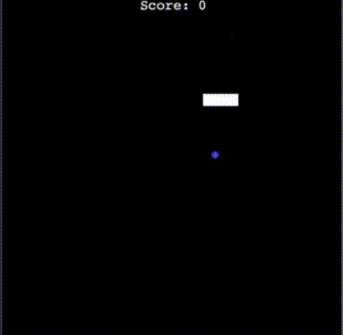
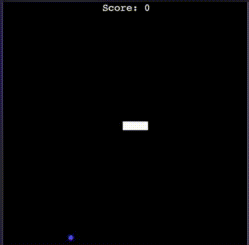
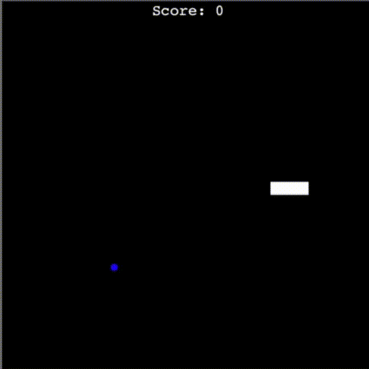
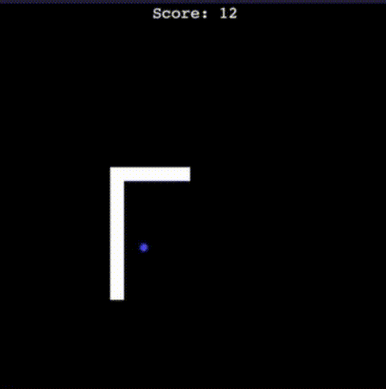

# Snake Game
This project is about creating Snake Game using Python Turtle Graphics.

<h4>Add Food and Detect Collisions with Food</h4>

<h4>Create a Scoreboard and Keep Score</h4>

<h4>Detect Collisions with the Wall</h4>

<h4>Extend the Snake When Detect Collisions with Food</h4>

<h4>Detect Collisions with the Snake's Tail</h4>

